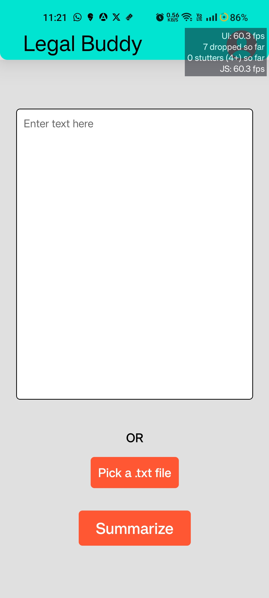
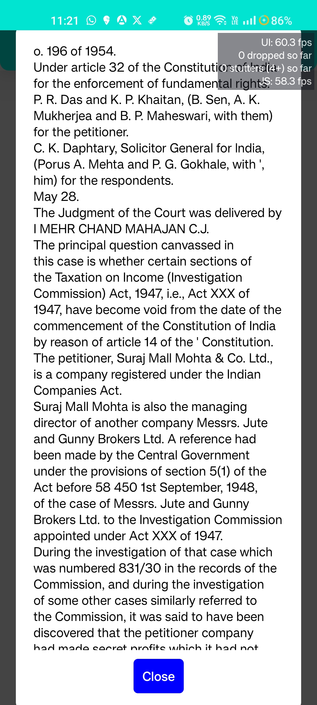
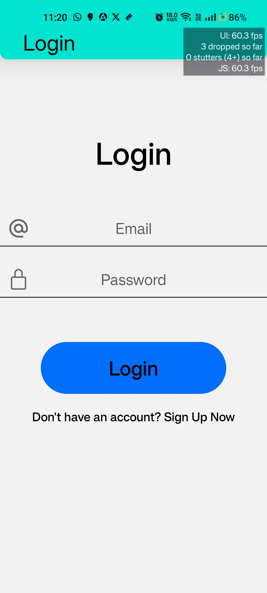
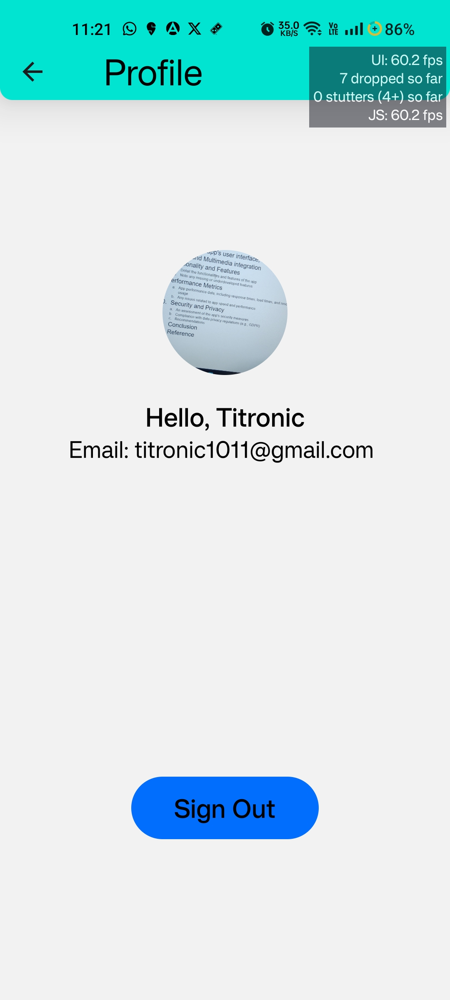
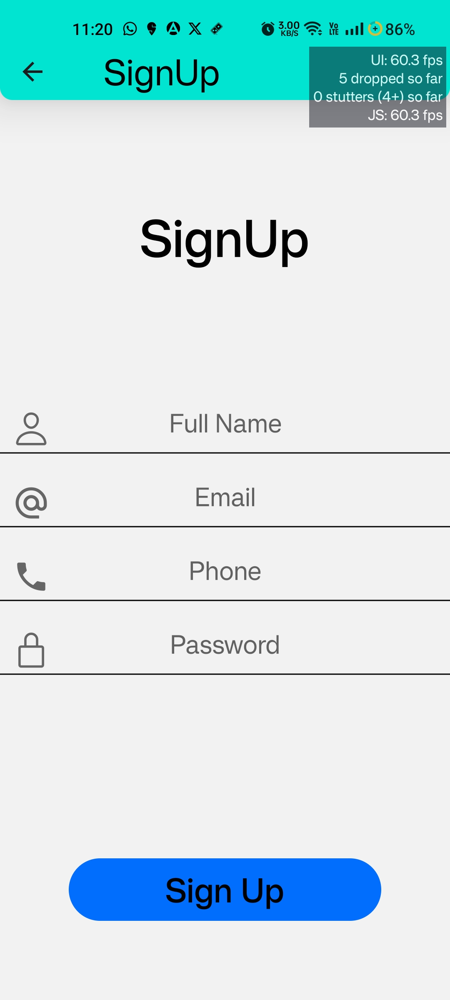

# Legal Bot App

## Overview
Welcome to the Legal Bot App repository! This repository contains the source code for a mobile application designed to assist legal professionals in analyzing and summarizing legal documents using Natural Language Processing (NLP) techniques. The app aims to streamline the process of comprehending complex legal texts and making informed decisions.

## Features
- **Text Input**: Easily input legal text either through typing or importing .txt files.
- **Summarization**: Automatically generate summaries of legal documents using advanced NLP algorithms.
- **File Viewer**: View the content of selected legal documents before summarization.
- **User Authentication**: Secure login and signup functionality for user accounts.
- **Profile Management**: Manage user profiles and preferences within the app.

Sure, here are the updated screenshots displayed side by side using HTML:

## Screenshots

  
  
  
  
  

## Demo Video

## Installation
1. Clone the repository to your local machine.
2. Navigate to the project directory.
3. Install dependencies using `npm install`.
4. Run the app using `expo start`.

## Technologies Used
- React Native
- Expo
- Firebase (Authentication, Firestore, Storage)
- Hugging Face Transformers
- Gradio
- FastAPI

## Feedback and Contributions
We welcome any feedback or contributions to improve the Legal Bot App. Feel free to open issues for bugs or feature requests, and submit pull requests with enhancements.

## Authors
- Harsh Gandhi
- Hemakshi Bhatnagar
- Jainil Patel
- Tanvi Jatkar

## License
This project is licensed under the MIT License - see the [LICENSE](LICENSE) file for details.
